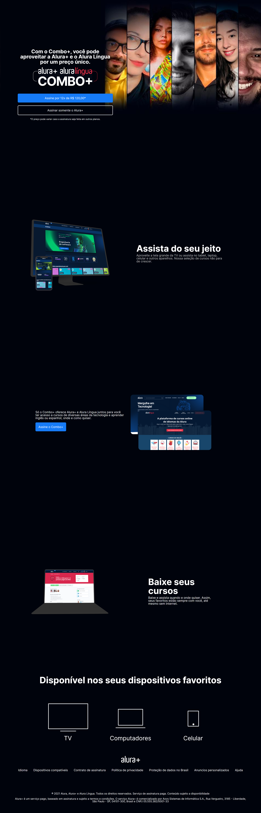

## Sobre  ⚡⚡

Este Projeto foi desenvolvido no curso da Alura a instrutora é a Mônica Mazzochi Hillman

## Diferenciais

Foi realizado algumas animações nas imagens, nese projeto um plus amais

## tecnologias
- HTML
- CSS
- GIT/ GITHUB

[🔗 Clique aqui para acessar o site.](https://alura-e-alura-linguas.vercel.app)
## Imagem de como o site está:

